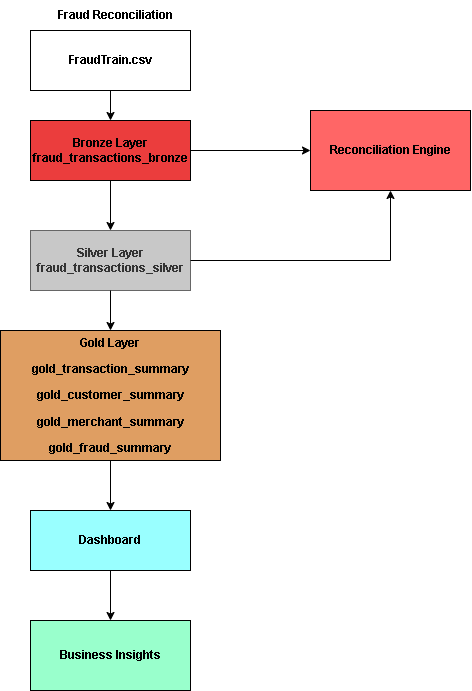
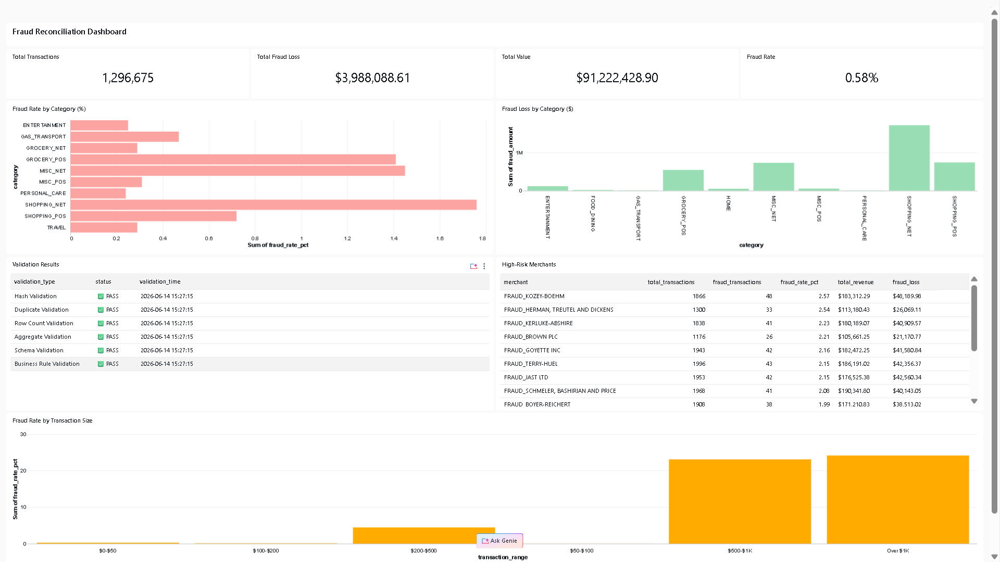
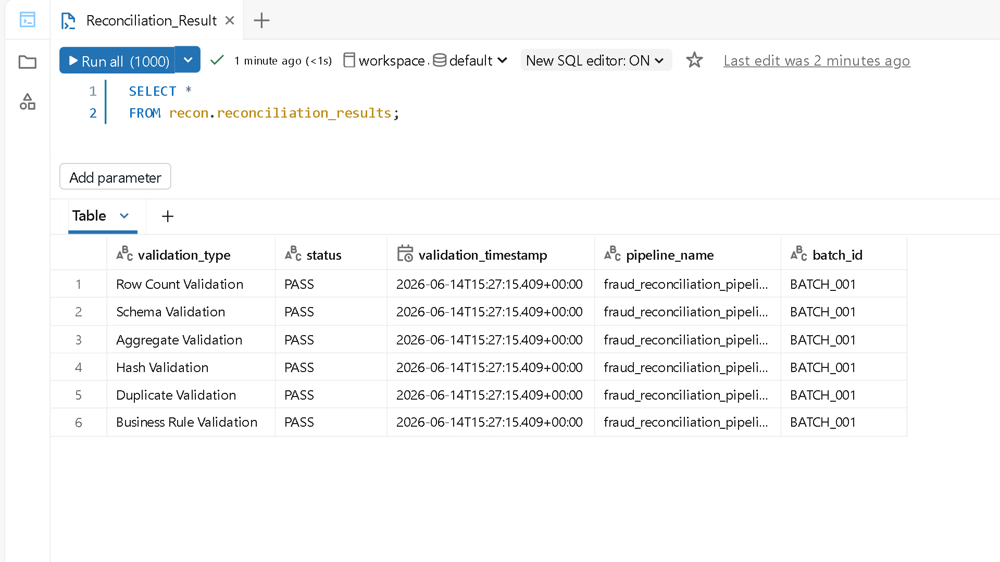
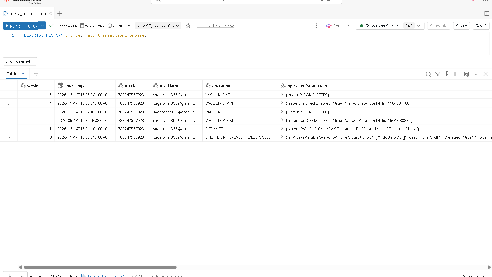

# Fraud Transaction Reconciliation Framework

## 🎯 Problem Statement

The objective of this project is to build a reconciliation framework that validates data consistency across Bronze, Silver and Gold layers in a Databricks Lakehouse environment. The project uses a fraud transaction dataset containing more than 1.2 million records and performs automated validation checks to ensure data quality and integrity throughout the pipeline.

---

## 📊 Dataset

**Source:** Fraud Detection Dataset (Kaggle)

**Records:** 1,296,675

**Features:**
- Customer information
- Merchant information
- Transaction amount
- Transaction category
- Fraud indicator
- Transaction timestamp

**Period Covered:** January 2019 – June 2020

---

## 🛠️ Technologies Used

| Technology | Purpose |
|------------|----------|
| **Databricks** | Cloud-based unified analytics platform |
| **Delta Lake** | ACID transactions, time travel, data versioning |
| **PySpark** | Distributed data processing at scale |
| **Unity Catalog** | Centralized data governance & security |
| **SQL** | Analytics, aggregations & reporting |
| **Python** | ETL orchestration & data quality framework |

---

## 🏛️ Architecture



---

## 📋 Project Workflow

1. Load fraudTrain.csv into Unity Catalog Volume
2. Ingest raw data into Bronze Delta table
3. Apply cleansing and transformations in Silver layer
4. Run reconciliation validations between Bronze and Silver
5. Create analytical summaries in Gold layer
6. Optimize Delta tables using OPTIMIZE and VACUUM
7. Build dashboard for business reporting

---

## ✨ Key Features

### 1. Medallion Architecture (Bronze-Silver-Gold)
- **Bronze Layer:** Raw data ingestion with metadata enrichment
- **Silver Layer:** Cleansed, deduplicated, validated data
- **Gold Layer:** Business-level aggregations and analytics

### 2. Reconciliation Framework
- ✅ **Row Count Validation:** Ensures no data loss between layers
- ✅ **Aggregate Validation:** Verifies consistency of transaction amounts
- ✅ **Hash Validation:** Detects data corruption or tampering
- ✅ **Schema Validation:** Confirms all required columns present
- ✅ **Duplicate Detection:** Identifies and flags duplicate records
- ✅ **Business Rule Validation:** Enforces domain-specific constraints

### 3. Delta Lake Optimization
- **OPTIMIZE:** File compaction for query performance
- **VACUUM:** Storage cleanup and retention management
- **Time Travel:** Query historical data snapshots
- **Version Control:** Track all data changes with audit trail

### 4. Data Quality Monitoring
- **DQ Status Flags:** PASSED/FAILED classification
- **Validation Results Table:** Complete audit history
- **100% Pass Rate:** All 6 validations passed successfully

### 5. Interactive Dashboard
- Interactive dashboard with KPIs, trend analysis, fraud insights and reconciliation monitoring

---

## 📊 Results & Metrics

| Metric | Value |
|--------|-------|
| **Total Records Processed** | 1,296,675 |
| **Fraud Transactions Detected** | 7,506 (0.58%) |
| **Total Transaction Amount** | $91,222,428.90 |
| **Unique Customers** | 983 |
| **Unique Merchants** | 700 |
| **Time Period** | Jan 2019 - Jun 2020 (18 months) |
| **Validation Success Rate** | 100% (6/6 PASS) |
| **Data Quality Status** | 100% PASSED |
| **Peak Transaction Month** | Dec 2019 ($9.92M) |
| **Top Merchant Revenue** | $302,481 (FRAUD_BRADTKE PLC) |

---

## 💼 Business Value

This framework ensures that data moving across the lakehouse layers remains accurate and consistent. The reconciliation process helps identify data loss, schema mismatches, duplicate records, and transformation issues before the data reaches reporting and analytics layers.

**Key benefits:**
- Improved trust in analytical reports
- Early detection of data quality issues
- Automated validation across pipeline stages
- Auditability through reconciliation logs
- Better performance using Delta Lake optimization

---

## ✅ Validation Results

| Validation Type | Status |
|-----------------|--------|
| Row Count Validation | PASS |
| Aggregate Validation | PASS |
| Hash Validation | PASS |
| Schema Validation | PASS |
| Duplicate Validation | PASS |
| Business Rule Validation | PASS |

**Overall Result:** 6/6 Validations Passed

---

## 📁 Project Structure

```
Vrahad-Reconciliation-Framework/
│
├── notebooks/
│   ├── 01_setup.py
│   ├── 02_bronze_ingestion.py
│   ├── 03_silver_transformation.py
│   ├── 04_gold_transformation.py
│   ├── 05_reconciliation_engine.py
│   ├── 06_dashboard_queries.sql
│   └── 07_delta_optimization.sql
│
├── sql/
│   ├── dashboard_queries.sql
│   └── reconciliation_queries.sql
│
├── screenshots/
│   ├── architecture.png
│   ├── dashboard_final.png
│   ├── reconciliation_results.png
│   └── delta_optimization.png
│
├── README.md
```

---

## 🚀 How to Run

### Prerequisites
- Databricks workspace (Free Edition or higher)
- Unity Catalog enabled
- Serverless compute or SQL Warehouse
- Source data: `fraudTrain.csv`

### Step-by-Step Execution

1. **Clone Repository**
   ```bash
   git clone <your-github-repository-url>
   ```

2. **Import Notebooks to Databricks**
   - Navigate to Databricks workspace
   - Import all notebooks from `/notebooks/` folder
   - Place in: `/Users/<your-email>/Vrahad_Recon_Project/`

3. **Upload Source Data**
   - Create Unity Catalog volume: `workspace.vrahad_recon.raw_data`
   - Upload `fraudTrain.csv` to volume

4. **Run Notebooks in Sequence**
   ```
   01_setup                  → Create schemas & volume
   02_bronze_ingestion       → Ingest raw data
   03_silver_transformation  → Cleanse & validate
   04_gold_transformation    → Create aggregates
   05_reconciliation_engine  → Run validations
   06_dashboard_queries      → Test dashboard queries
   07_delta_optimization     → Optimize tables
   ```

5. **Create Dashboard**
   - Create visualizations using the SQL queries available in the project
   - Arrange dashboard layout

6. **View Results**
   - Dashboard: Real-time KPIs and charts
   - Tables: Query bronze/silver/gold layers
   - Validation: Check `recon.reconciliation_results`

---

## 📸 Screenshots

### Dashboard Overview


### Architecture


### Reconciliation Results (6/6 PASS)


### Delta Optimization


---

## 🎓 Key Learnings

During this project I gained hands-on experience with:

- Medallion architecture in Databricks
- Delta Lake optimization techniques
- Data quality and reconciliation frameworks
- Unity Catalog governance
- Building analytical dashboards
- Performance tuning using OPTIMIZE and VACUUM
- Time travel and version management in Delta Lake

---


---

## 👤 Author

**Sagar Aher**
- GitHub:https://github.com/Sagaraher01/fraud-transaction-reconciliation-framework